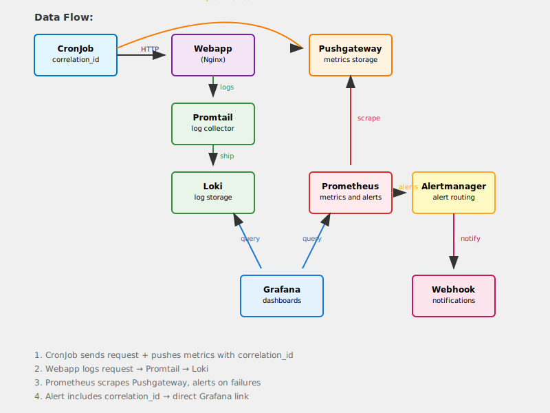

# 🚀 Observability Stack with Correlation-Based Alerting

This project provides a **complete observability playground** on Kubernetes featuring **exact correlation ID tracking** from CronJob failures to specific log entries.

## Architecture



## End-to-End Flow
```
CronJob (correlation_id)
↓ (HTTP request)
Webapp (logs error with correlation_id)
↓ (structured logs)
Promtail → Loki (stores logs)
CronJob (same correlation_id)
↓ (push metrics)
Pushgateway (stores with correlation_id label)
↓ (Prometheus scrapes)
Prometheus (detects failure, correlation_id in alert)
↓ (fires alert)
Alertmanager → Webhook (alert payload includes correlation_id + Grafana link)
↓ (notification)
Operator clicks link → Grafana (filtered to exact correlation_id) → Exact logs
```

## Stack Components

- **k3d** (lightweight k3s-based cluster)
- **Prometheus** (metrics collection & alerting)
- **Pushgateway** (CronJob metrics storage)
- **Loki + Promtail** (log collection & storage)
- **Grafana** (unified dashboards)
- **Alertmanager** (alert routing with webhooks)
- **Tracing App** (demo webapp with structured JSON logging)

---

## 🛠️ Requirements

Make sure you have the following installed:

- [k3d](https://k3d.io/)  
- [kubectl](https://kubernetes.io/docs/tasks/tools/)  
- [helm](https://helm.sh/docs/intro/install/)  

---

## 📦 Deployment

Spin up the full stack with a single command:

```bash
./deploy.sh
```

This will:

1. Create a local **k3d** cluster
2. Add required **Helm repositories**
3. Deploy **Prometheus** (metrics & alerting)
4. Deploy **Pushgateway** (CronJob metrics storage)
5. Deploy **Loki + Promtail** (log collection)
6. Deploy **Grafana** (dashboards)
7. Apply **custom PrometheusRules** and **AlertmanagerConfig**
8. Deploy **Tracing App** (demo webapp)
9. Start port-forwards for all services

🧹 **Cleanup:**
```bash
./cleanup.sh
```

---

## 🎯 Key Innovation: Exact Correlation Tracking

This stack implements **precise correlation between alerts and logs**:

1. **CronJob** generates unique `correlation_id` (e.g., `req-20250922-143021-87654`)
2. **Pushgateway** stores metrics with the exact correlation ID
3. **Prometheus** alerts include the correlation ID as a label
4. **Alerts contain direct Grafana links** filtered to that specific correlation ID
5. **One-click debugging** from alert to exact log entry

### Alert Flow
```
CronJob fails → Pushgateway metrics → Prometheus alert → 
Webhook with Grafana link → Click → Exact logs for that request
```

---

## 🔗 Access Points

After deployment, access these services:

- **Grafana**: http://localhost:3000 (`admin`/`admin`)
- **Prometheus**: http://localhost:9090  
- **Alertmanager**: http://localhost:9093
- **Pushgateway**: http://localhost:9091

---

## 🚨 Webhook Configuration

This project uses [webhook.site](https://webhook.site/) to simulate a Slack/Teams webhook endpoint for alert notifications.

**Setup:**
1. Go to https://webhook.site/
2. Copy your unique webhook URL
3. Update `alerts/alertmanager-webhook.yaml` with your URL:
   ```yaml
   webhookConfigs:
   - url: 'https://webhook.site/YOUR-UNIQUE-ID'
   ```
4. Reapply the configuration:
   ```bash
   kubectl apply -f alerts/alertmanager-webhook.yaml
   ```

When alerts fire, you'll see the full alert payload (including correlation ID and Grafana URL) at your webhook.site URL.

---

## 🧪 Testing Alerts

Alerts are **automatically triggered** by the CronJob's built-in error simulation:

- **CronJob runs every minute**
- **At minutes 0, 5, 10, 15, 20, etc.** (divisible by 5): Hits `/simulate-error` → Returns HTTP 500
- **Other minutes**: Hits `/` → Returns HTTP 200 (success)

**Watch alerts in real-time:**
```bash
# Monitor CronJob execution
watch kubectl get jobs -n my-demo -l app=request-sender-conditional

# Check webhook.site for alert notifications
# Alerts will appear every 5 minutes with correlation IDs and Grafana links

# View active alerts in Prometheus
curl -s http://localhost:9090/api/v1/alerts | jq '.data.alerts'
```

**Manual failure test (optional):**
```bash
# Scale down webapp to cause unexpected 503 errors
kubectl scale deployment webapp-deployment -n my-demo --replicas=0

# Restore service
kubectl scale deployment webapp-deployment -n my-demo --replicas=1
```

---

## ✅ Verification

For detailed step-by-step verification of the entire observability stack, see:

**📋 [Observability Verification Checklist](docs/observability-verification-checklist.md)**

This guide covers:
- Port forwarding setup (required for all API access)
- Verifying CronJob → Pushgateway → Prometheus flow
- Checking ServiceMonitor and PrometheusRule configuration
- Confirming alerts are firing correctly
- Troubleshooting common label selector issues

---

## 📊 Pre-configured Components

### Grafana Dashboards
- **Logs Dashboard** (`uid: simple-logs`)
  - Queries `{app="tracing-app"}`
  - **Correlation ID filter** variable
  - Direct links from alerts

### Datasources
- **Prometheus** → `http://dev-prometheus-kube-promet-prometheus.observability.svc.cluster.local:9090`
- **Loki** → `http://dev-loki.observability.svc.cluster.local:3100`

### Alert Rules
- **CronJobFailedWithExactCorrelationID**: Fires when CronJob fails, includes correlation ID
- **CronJobNotRunningRecently**: Fires when CronJob hasn't run in 5+ minutes

---

## 📁 Project Structure

```
deploy.sh                     # Main deployment script
cleanup.sh                   # Teardown script
observability-stack-diagram_with_bg.svg  # Architecture diagram
values/                      # Helm configuration files
├── prometheus.yaml         # Prometheus stack config
├── pushgateway.yaml        # Pushgateway config
├── loki.yaml              # Loki config
├── promtail.yaml          # Promtail config
└── grafana.yaml           # Grafana config
alerts/                     # Custom alerting rules
├── preometheus-rules-cronjob-alerts    # PrometheusRule definitions
└── alertmanager-webhook.yaml  # AlertmanagerConfig
tracing-app-helm-chart/     # Demo application
docs/                       # Documentation
└── observability-verification-checklist.md  # Verification guide
```

---

## 🔍 Example Correlation Workflow

1. **CronJob runs** with correlation ID `req-20250922-143021-87654`
2. **Request fails** (webapp scaled to 0 replicas)
3. **Pushgateway stores** metrics with correlation ID label
4. **Prometheus alert fires** with correlation ID included
5. **Webhook receives alert** with direct Grafana URL:
   ```
   http://localhost:3000/d/simple-logs/logs?var-correlation_id=req-20250922-143021-87654
   ```
6. **Click link** → See exact logs for that failed request
7. **Root cause analysis** in seconds, not minutes

---

## ⚡ Quick Start

```bash
# Deploy entire stack
./deploy.sh

# Open Grafana
open http://localhost:3000

# Trigger test alert
kubectl scale deployment webapp-deployment -n my-demo --replicas=0

# Check your webhook endpoint for correlation-based alerts
```

---

## 🎯 Why This Matters

Traditional observability stacks require manual correlation between alerts and logs. This implementation provides:

- **Zero manual correlation** - alerts include exact correlation IDs  
- **Direct navigation** - one-click from alert to specific logs
- **Faster MTTR** - reduce debugging time from minutes to seconds
- **Production patterns** - uses industry-standard tools (Pushgateway, Prometheus, etc.)
- **Scalable design** - works for multiple services and complex deployments

Perfect for demonstrating modern observability practices and correlation-based debugging workflows.